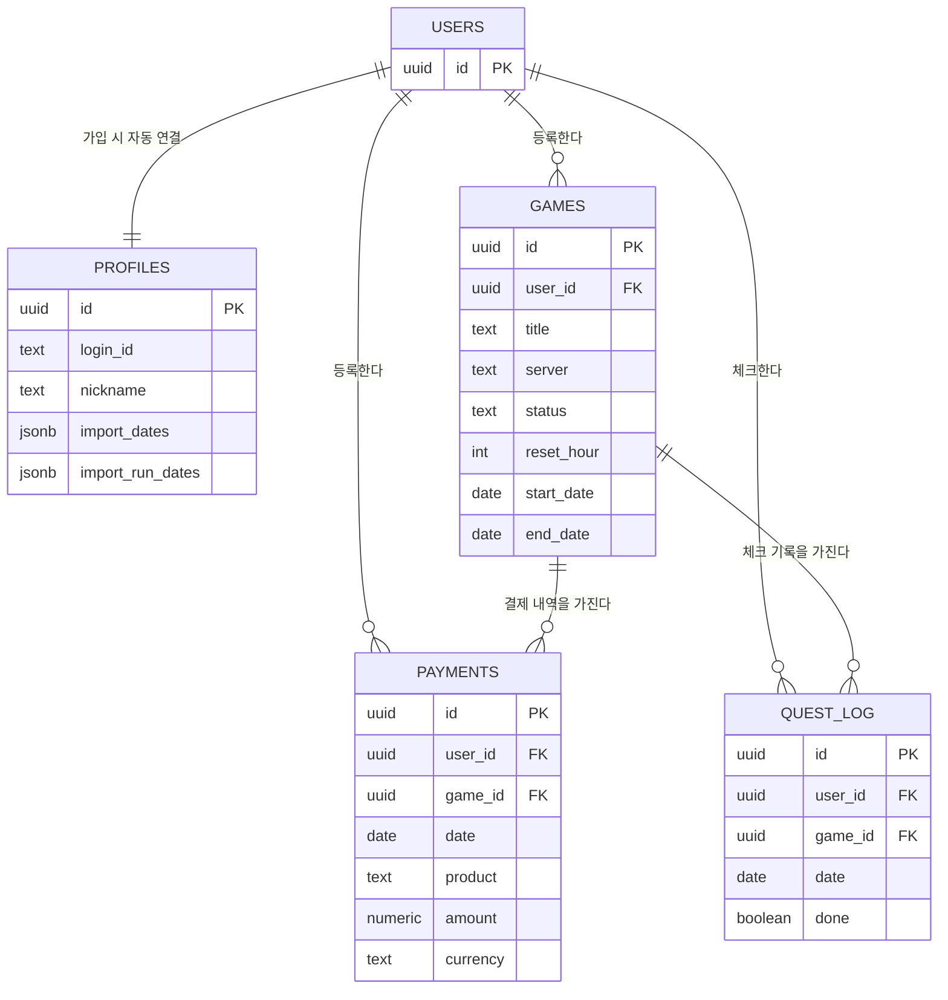

# 🎲 Dailies & Gacha Biyori
### 일퀘가챠 하기 좋은 날 — デイリー＆ガチャ日和

여러 개의 가챠 게임을 하다 보면 흔히 겪는 두 가지 문제를 해결하기 위해 만든 개인용 웹앱입니다.

> "오늘 일퀘 다 돌렸나?" · "이번 달에 이 게임에 도대체 얼마를 쓴 거지?"

**[👉 지금 써보기](https://dorickcal.github.io/dailies-and-gacha-biyori/)**

---

## ✨ 주요 기능

- **일일퀘스트 체크** — 게임마다 다른 초기화 시각을 반영해서 "오늘"을 정확히 계산하고, 연속 달성일(스트릭)을 추적
- **과금 기록 관리** — 게임별·통화별(₩/¥) 결제 내역을 기록하고, 구글 플레이 · PayPay 결제 내역 파일을 가져와 자동으로 매칭
- **통계** — 게임별 과금 비율, 월별 과금 추이를 한눈에
- **계정별 데이터 분리** — 아이디/비밀번호로 로그인, 각자의 데이터는 완전히 독립적으로 저장

## 🛠 기술 스택

| 영역 | 사용 기술 |
|---|---|
| 프론트엔드 | React 18 (CDN) + Babel Standalone — 별도 빌드 과정 없는 단일 HTML 파일 |
| 백엔드 / DB | [Supabase](https://supabase.com) (PostgreSQL + Auth + Row Level Security) |
| 호스팅 | GitHub Pages (정적 파일 호스팅, 서버 없음) |

## 🗂 데이터 구조

모든 테이블은 **Row Level Security**로 보호되어, 각 사용자는 자신의 데이터만 읽고 쓸 수 있습니다.

## 🚀 직접 배포하기

이 프로젝트는 서버 없이 정적 파일 하나로 동작합니다. 자신만의 인스턴스를 띄우려면:

1. [Supabase](https://supabase.com)에서 새 프로젝트 생성
2. `supabase/` 폴더의 SQL 파일들을 순서대로 SQL Editor에서 실행 (테이블 생성 → 인증 함수 → RLS 정책)
3. `index.html` 상단의 `SUPABASE_URL`, `SUPABASE_ANON_KEY`를 자신의 프로젝트 값으로 교체
4. GitHub Pages, Cloudflare Pages, Netlify 등 아무 정적 호스팅에 `index.html` 업로드
5. Supabase 대시보드 → Authentication → URL Configuration에서 Site URL / Redirect URLs를 배포 주소로 설정

## 📝 이름에 대하여

제목은 개그 만화 『ギャグマンガ日和(개그만화 보기 좋은 날)』의 언어유희 구조 "OO日和(~하기 좋은 날)"에서 따왔습니다.

## 📄 라이선스

개인 프로젝트로, 별도 라이선스 없이 자유롭게 참고하셔도 됩니다.
